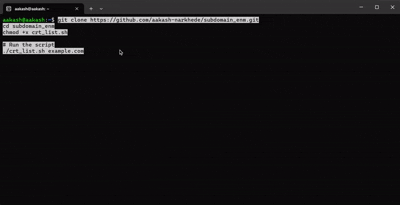

# 🌐 crt_list.sh – CRT.sh Domain Enumerator


---

## 🚀 Overview

`crt_list.sh` is a **simple Bash script** to fetch and list **all subdomains / certificate domains** from [crt.sh](https://crt.sh/) for any target domain.  
It prints **unique results** directly in your terminal and optionally shows a **progress bar** while fetching.

Perfect for:  
- 🛡️ Bug bounty & Red Teaming  
- 🔍 OSINT / Recon  
- 🌐 Subdomain enumeration  

---

## 📦 Requirements

- `curl`  
- `jq`  
- `pv` (optional, for progress bar)  

**Install dependencies (Ubuntu / Debian):**
```bash
sudo apt update
sudo apt install curl jq pv -y
```
**macOS (Homebrew):**
```bash
brew install curl jq pv
```
**🏃 Usage**
```bash
git clone https://github.com/aakash-narkhede/subdomain_enm.git
cd subdomain_enm
chmod +x crt_list.sh

# Run the script
./crt_list.sh example.com
```
**Save output to a file:**
```bash
./crt_list.sh example.com > domains.txt
```
**🎨 Demo**
<p align="center">
  
</p>

